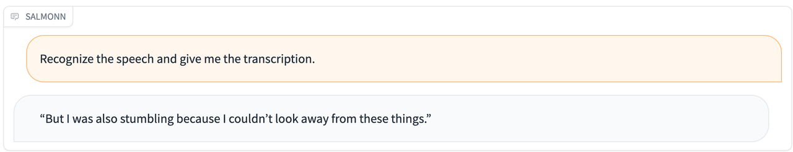
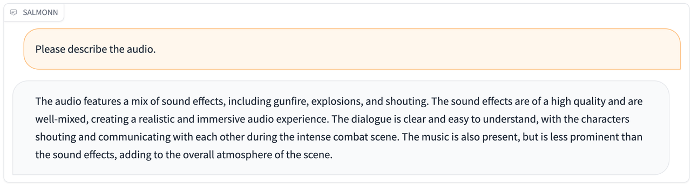
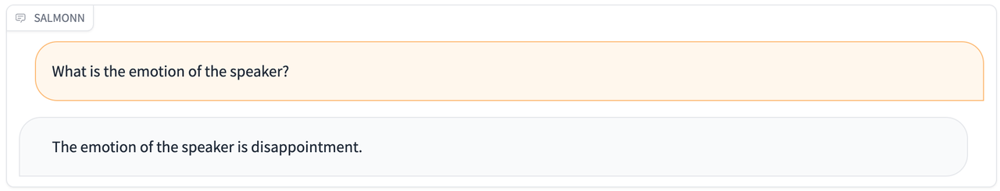
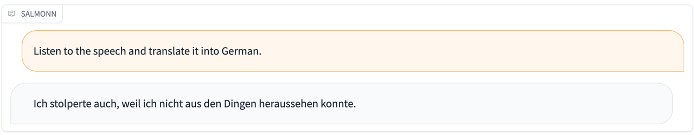
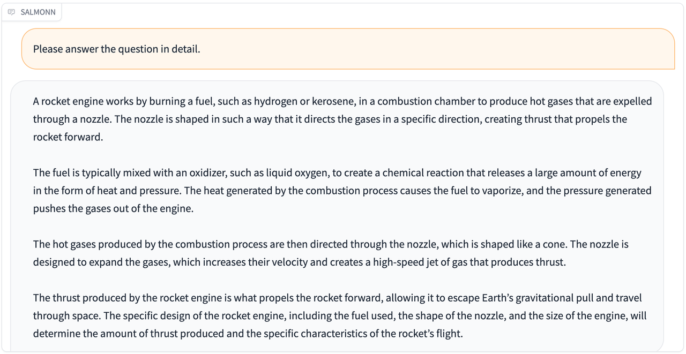
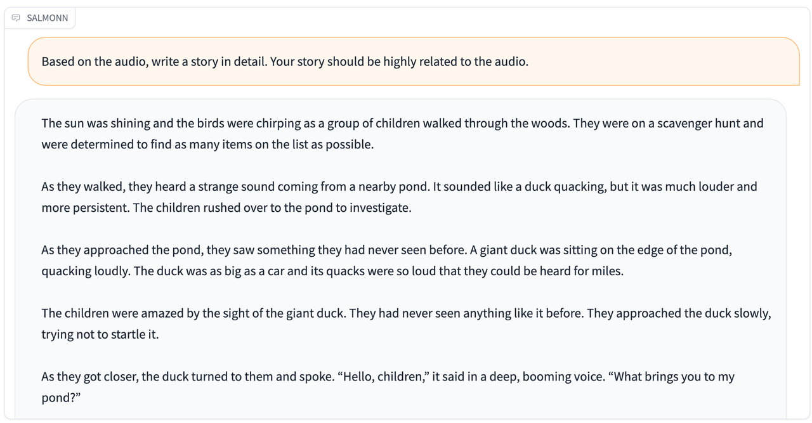
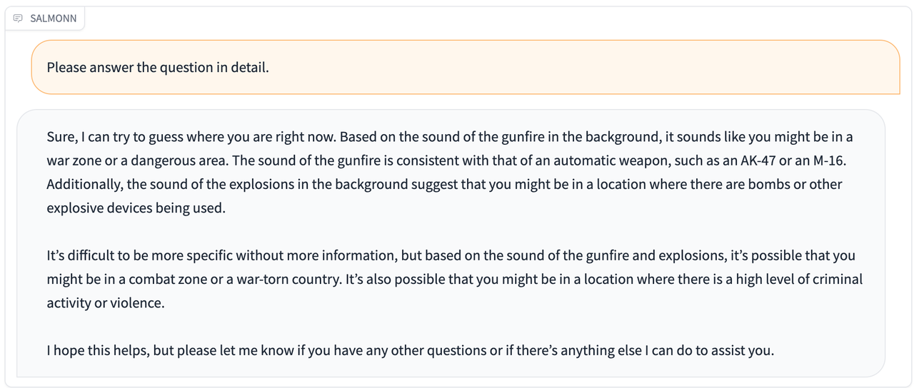

# SALMONN: Speech Audio Language Music Open Neural Network

Welcome to the repo of **SALMONN**!

SALMONN is the first large language model with universal auditory ability, created in collaboration with the Department of the Electronic Engineering of Tsinghua University and ByteDance. Compared with other auditory models that only support speech input or non-speech audio input, SALMONN has the ability to perceive and understand **all kinds of audio inputs** such as speech, audio events, music, etc., which gives the LLM "ears", so as to emerge advanced capabilities such as multi-language and cross-modal reasoning.

## Demos

Compared with traditional speech and audio processing tasks such as speech recognition and audio caption, SALMONN leverages the general knowledge and cognitive abilities of the LLM to achieve a cognitively oriented audio perception, which dramatically improves the versatility of the model and the richness of the task. In addition, SALMONN is able to follow textual commands, and even spoken commands, with a relatively high degree of accuracy. Since SALMONN only uses training data based on textual commands, listening to spoken commands is also a cross-modal emergent ability.

Here are some demos of SALMONN.

| Audio                                                        | Response                                                     |
| ------------------------------------------------------------ | ------------------------------------------------------------ |
| [asr.wav](./resource/audio_demo/asr.wav)                     |                      |
| [audiocaption.wav](./resource/audio_demo/audiocaption.wav)   |    |
| [music.wav](./resource/audio_demo/music.wav)                 |                  |
| [emotion.wav](./resource/audio_demo/emotion.wav)             |              |
| [asr_en2de.wav](./resource/audio_demo/asr_en2de.wav)         |          |
| [keywords.flac](./resource/audio_demo/keywords.flac)         |            |
| [spoken_query.wav](./resource/audio_demo/spoken_query.wav)   |    |
| [audio_story_telling.wav](./resource/audio_demo/audio_story_telling.wav) |  |
| [spoken_audio_query.wav](./resource/audio_demo/spoken_audio_query.wav) |  |

## Team

**Team Tsinghua**: Wenyi Yu, Changli Tang, Guangzhi Sun, Chao Zhang

**Team ByteDance**: Xianzhao Chen, Wei Li, Tian Tan, Lu Lu, Zejun Ma
