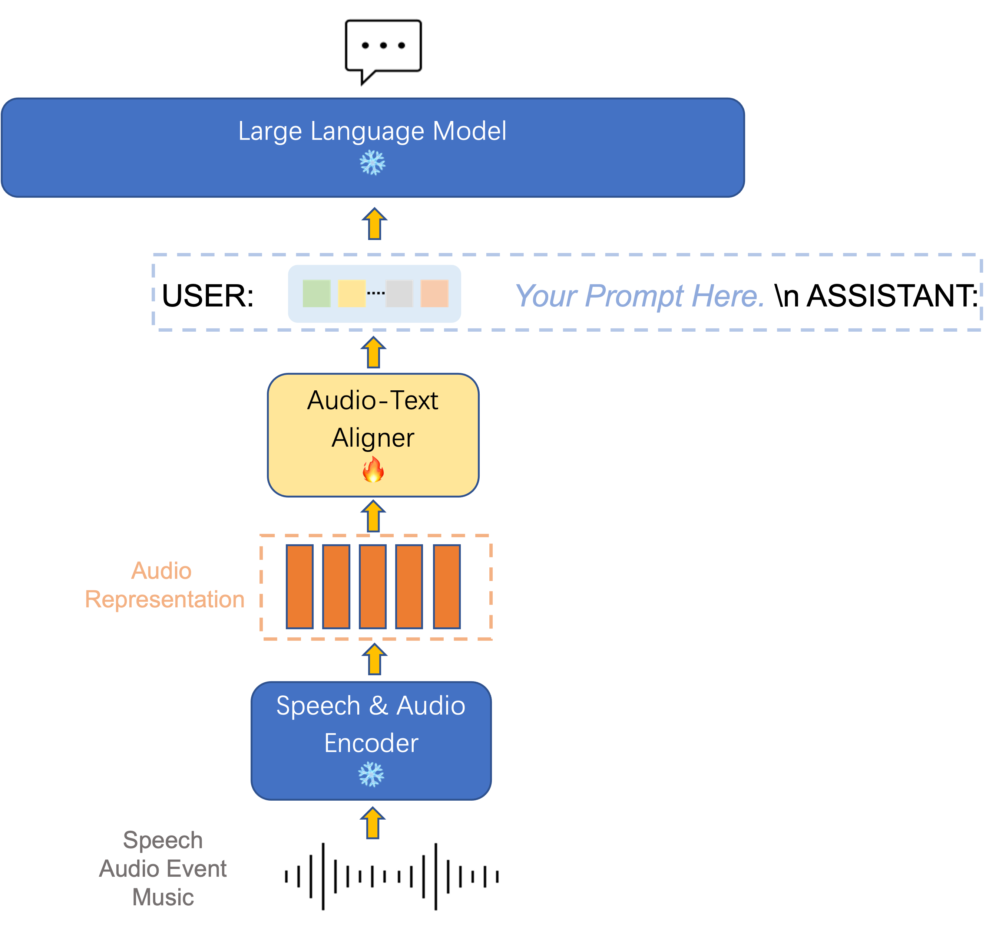

# SALMONN: Speech Audio Language Music Open Neural Network

Welcome to the repo of **SALMONN**!

SALMONN is a large language model (LLM) enabling speech, audio event, and music inputs, which is created by the Department of Electronic Engineering of Tsinghua University and ByteDance. Instead of speech-only input or audio-event-only input, SALMONN can perceive and understand all kinds of audio inputs and therefore obtains emerging capabilities such as multilingual speech recognition & translation and audio-speech reasoning. This can be regarded as giving the LLM "ears" to have cognitive hearing abilities, which makes SALMONN a step towards hearing-enabled artificial general intelligence.

We will open source the code and the model checkpoint soon. Stay tuned!

## Structure

SALMONN adopts a speech & audio encoder to encode generic audio representation, then uses an audio-text aligner to map the audio feature into textual space. Finally, the large language model answers based on the textual prompt and the auditory tokens.

## Demos

Compared with traditional speech and audio processing tasks such as speech recognition and audio caption, SALMONN leverages the general knowledge and cognitive abilities of the LLM to achieve a cognitively oriented audio perception, which dramatically improves the versatility of the model and the richness of the task. In addition, SALMONN is able to follow textual commands, and even spoken commands, with a relatively high degree of accuracy. Since SALMONN only uses training data based on textual commands, listening to spoken commands is also a cross-modal emergent ability.

Here are some demos of SALMONN.

| Audio                                                        | Response                                                     |
| ------------------------------------------------------------ | ------------------------------------------------------------ |
| [asr.wav](./resource/audio_demo/asr.wav)                     |                      |
| [audiocaption.wav](./resource/audio_demo/audiocaption.wav)   |    |
| [music.wav](./resource/audio_demo/music.wav)                 |                  |
| [emotion.wav](./resource/audio_demo/emotion.wav)             |              |
| [asr_en2de.wav](./resource/audio_demo/asr_en2de.wav)         |          |
| [keywords.flac](./resource/audio_demo/keywords.flac)         |            |
| [spoken_query.wav](./resource/audio_demo/spoken_query.wav)   |    |
| [audio_story_telling.wav](./resource/audio_demo/audio_story_telling.wav) |  |
| [spoken_audio_query.wav](./resource/audio_demo/spoken_audio_query.wav) |  |

## Team

**Team Tsinghua**: Wenyi Yu, Changli Tang, Guangzhi Sun, Chao Zhang

**Team ByteDance**: Xianzhao Chen, Wei Li, Tian Tan, Lu Lu, Zejun Ma
