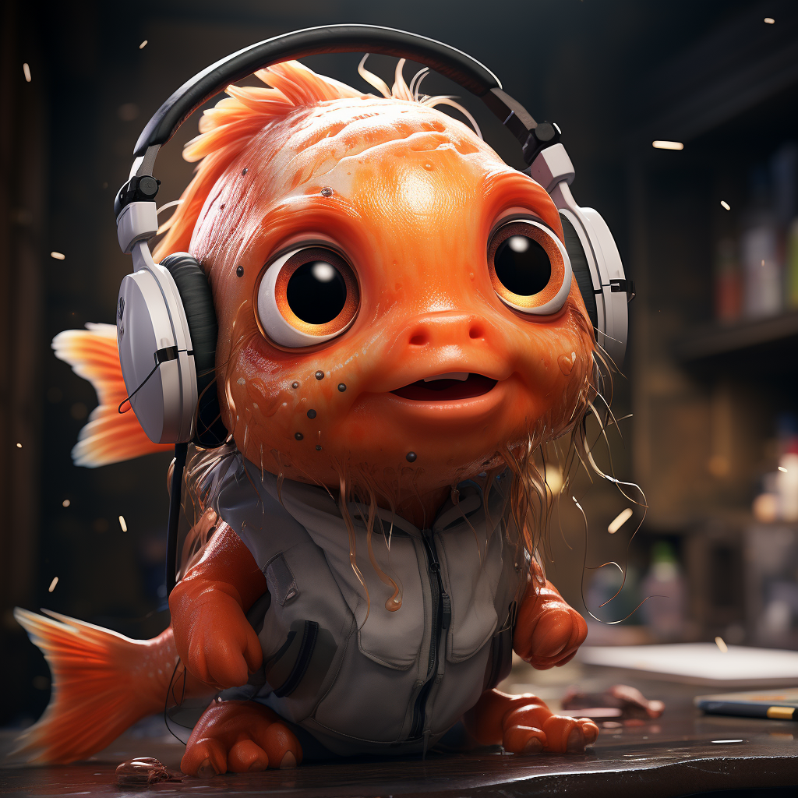

# SALMONN: Speech Audio Language Music Open Neural Network

Welcome to the repo of **SALMONN**!

SALMONN is the first large language model with universal auditory ability, created in collaboration with the Department of the Electronic Engineering of Tsinghua University and ByteDance. Compared with other auditory models that only support speech input or non-speech audio input, SALMONN has the ability to perceive and understand **all kinds of audio inputs** such as speech, audio events, music, etc., which gives the LLM "ears", so as to emerge advanced capabilities such as multi-language and cross-modal reasoning.

 

**Team Tsinghua**: Wenyi Yu, Changli Tang, Guangzhi Sun, Chao Zhang

**Team Bytedance**: Xianzhao Chen, Wei Li, Tian Tan, Lu Lu, Zejun Ma

## Online Demo Demonstration

​<audio id="audio" controls="" preload="none">
<source id="wav" src="resource/asr.wav">
</audio>

