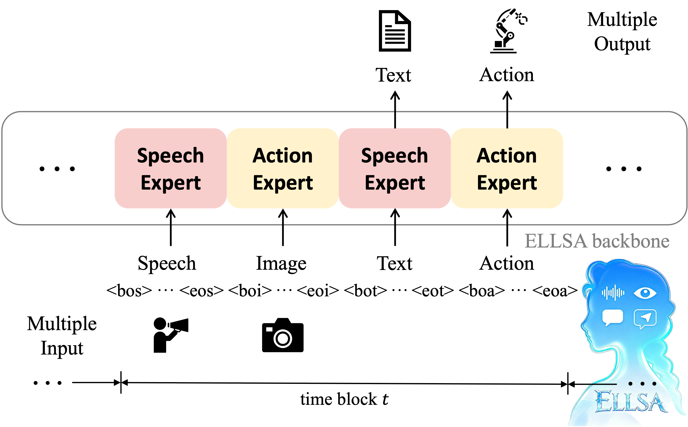
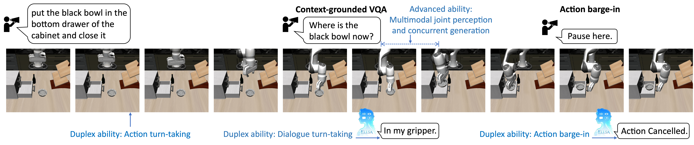

# ELLSA: End-to-end Listen, Look, Speak and Act

<div align="center">

<div>
    <a href="https://arxiv.org/pdf/2510.16756" target="_blank">
      
    </a>
    <a href="https://github.com/bytedance/SALMONN/tree/ELLSA" target="_blank">
      
    </a>
    <a href="https://huggingface.co/tsinghua-ee/ELLSA" target="_blank">
      
    </a>
    <a href="https://huggingface.co/datasets/tsinghua-ee/ELLSA_test_data" target="_blank">
      
    </a>
    
</div>

</div>

The **first** end-to-end model that unifies **vision, speech, text and action** in a **streaming full-duplex** framework, enabling joint multimodal perception and concurrent generation. 

<p align="center">
    
</p>

## 🧪 Highlights
* **Full-Duplex Multimodal Interaction**: unifies *listening*, *looking*, *speaking*, and *acting* in a single end-to-end architecture, enabling simultaneous multimodal perception and generation.
* **SA-MoE Architecture for Efficient Multimodal Fusion**: utilizes modality-specific experts with shared *attention* to reduce interference and leverage the capabilities of pretrained models.
* **Unique Human-like Capabilities**: supports *speaking-while-acting*, *context-grounded VQA*, *instruction rejection*, and *action barge-in*, enabling more natural interactive intelligence.

## 🔧 REPO TODO List
- [x] Support for evaluation on speech interaction.
- [x] Support for evaluation on LIBERO.
- [ ] Support for evaluation on CALVIN.
- [ ] Release the training data.
- [ ] Support for training.

## 📚 Experiments

### Basic Capabilities

On speech-interaction and robotmanipulation benchmarks, ELLSA matches modality-specific baselines.

##### Speech Interaction

| Model        | Llama Q. S2T | Llama Q. S2S | Web Q. S2T | Web Q. S2S | TriviaQA S2T | TriviaQA S2S | AlpacaEval S2T | AlpacaEval S2S |
|--------------|--------------|--------------|------------|------------|--------------|--------------|----------------|----------------|
| Moshi        | 60.8         | 54.5         | 23.4       | 22.1       | 25.6         | 16.7         | 1.84           | 1.76           |
| Freeze-Omni  | 74.2         | 56.2         | **40.8**   | 27.9       | 45.1         | 28.5         | **3.90**       | 2.46           |
| **ELLSA**        | **74.7**     | **70.0**     | 39.5       | **36.5**   | **45.2**     | **41.7**     | 3.09           | **2.80**       |

##### Speech-conditioned Robot Manipulation

| Model        | SPATIAL | OBJECT | GOAL  | LONG  | Average |
|--------------|--------|--------|-------|-------|---------|
| DP*          | 78.3%  | 92.5%  | 68.3% | 50.5% | 72.4%   |
| Octo         | 78.9%  | 85.7%  | 84.6% | 51.1% | 75.1%   |
| OpenVLA      | 84.9%  | 88.4%  | 79.2% | 53.7% | 76.5%   |
| SpatialVLA   | 88.2%  | 89.9%  | 78.6% | 55.5% | 78.1%   |
| CoT-VLA      | 87.5%  | 91.6%  | 87.6% | 69.0% | 81.1%   |
| π₀-FAST      | **96.4%** | **96.8%** | **88.6%** | 60.2% | 85.5%   |
| **ELLSA**        | 90.8%  | 95.8%  | 86.4% | **84.4%** | **89.4%** |

### Advanced Capabilities

ELLSA can accomplish tasks previously unattainable, such as *dialogue and action turn-taking prediction*, *rejection of defective instructions*, *speaking while acting* and *responding to action barge-ins*. These results highlight the feasibility and significance of full-duplex multimodal interaction as a foundation for more natural and general multimodal interactive intelligence.

<div align="center">
  
  <br>
  <em>An example of ELLSA’s advanced capabilities: starting from a spoken instruction, the model executes the action, engages in context-grounded VQA, and supports action barge-in. This instance demonstrates not only ELLSA’s core skills but also its unique advanced capabilities: its MIMO capacity to process multimodal inputs and outputs simultaneously, and its duplex capability to manage complex conversational dynamics such as turn-taking and interruptions.</em>
</div>

## 🛠️ Setup
Here we provide a conda environment setup for the project.
```shell
conda create -n ellsa python=3.10
conda activate ellsa
pip install -r requirements.txt
```
> If you run into issues installing `flash-attention` or `kaldifeat`, you can instead use the prebuilt wheels available here: [flash-attn prebuilt wheels](https://github.com/Dao-AILab/flash-attention/releases) and [kaldifeat prebuilt wheels](https://csukuangfj.github.io/kaldifeat/cuda.html).

## 🔥 Training
Coming soon...

## 🚀 Inference

### Required Checkpoints and Data

Before running inference, make sure to download all required checkpoints and Data.

| **Model**        | **Download** |
| :--- | :---: |
| **Emu3-vision** | [🤗 HuggingFace](https://huggingface.co/BAAI/Emu3-VisionTokenizer) |
| **UniVLA-LIBERO** | [🤗 huggingface](https://huggingface.co/Yuqi1997/UniVLA/tree/main/UNIVLA_LIBERO_VIDEO_BS192_8K) |
| **Llama-3.1-8B-Instruct** | [🤗 huggingface](https://huggingface.co/meta-llama/Llama-3.1-8B-Instruct) |
| **CosyVoice2-0.5B** | [🤗 huggingface](https://huggingface.co/FunAudioLLM/CosyVoice2-0.5B) |
| **ELLSA** | [🤗 huggingface](https://huggingface.co/tsinghua-ee/ELLSA) |

| **Data**        | **Download** |
| :--- | :---: |
| **Test Data** | [🤗 HuggingFace](https://huggingface.co/datasets/tsinghua-ee/ELLSA_test_data) |

### Speech Interaction

```shell
cd reference/RoboVLMs
bash scripts/run_eval_speech_only.sh ${CKPT_PATH} 
```

### Robot manipulation on LIBERO Benchmark

Build LIBERO environment and dataset based on the [instruction](docs/libero.md).

```shell
cd reference/RoboVLMs
bash scripts/run_eval_libero_contemporary.sh ${CKPT_PATH} 
```


<section class="section">
  <div class="container is-max-desktop">
    <h2 class="title is-4">📁 Code Structure</h2>
    <pre style="background-color: #f9f9f9; padding: 1.25rem; border-radius: 8px; font-size: 14px; overflow-x: auto;">
<span style="color: #6c757d;">ELLSA/</span>
├── <strong>configs/</strong>           <span style="color: #6c757d;"># Model configuration files</span>
├── <strong>models/</strong>            <span style="color: #6c757d;"># Tokenizer and diffusion test</span>
├── <strong>train/</strong>             <span style="color: #6c757d;"># Training dataset and pipeline</span>
├── <strong>reference/</strong>         <span style="color: #6c757d;"># Reference code</span>
│   ├── <strong>cosyvoice/</strong>     <span style="color: #6c757d;"># Speech synthesizer</span>
│   ├── <strong>Emu3/</strong>          <span style="color: #6c757d;"># Base code</span>
│   ├── <strong>RoboVLMs/</strong>      <span style="color: #6c757d;"># Evaluation code</span>
│   └── <strong>spear_encoder/</strong> <span style="color: #6c757d;"># Speech encoder</span>
├── <strong>scripts/</strong>           <span style="color: #6c757d;"># Shell scripts for training</span>
├── <strong>tools/</strong>             <span style="color: #6c757d;"># Data preprocessing tools</span>
└── <strong>README.md</strong>          <span style="color: #6c757d;"># Project description and user guide</span>
    </pre>
  </div>
</section>

## ❤️ Acknowledgement
Our work is built upon the following projects, Thanks for their great open-source work!
- [Emu3](https://github.com/baaivision/Emu3)
- [RoboVLMs](https://github.com/Robot-VLAs/RoboVLMs)
- [OpenVLA](https://github.com/openvla/openvla)
- [UniVLA](https://github.com/baaivision/UniVLA)

## 🌟 Citation
If you find this project useful, please consider citing our work:
```bibtex
@inproceedings{wang2026end,
  title={End-to-end Listen, Look, Speak and Act},
  author={Wang, Siyin and Yu, Wenyi and Chen, Xianzhao and Tian, Xiaohai and Zhang, Jun and Lu, Lu and Zhang, Chao},
  journal={Proc. ICLR},
  year={2026},
  address={Rio de Janeiro}
}
```