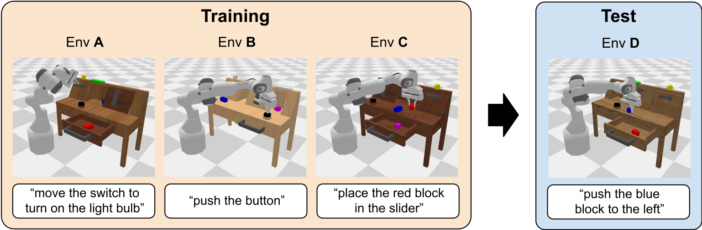

# CALVIN Benchmark

[CALVIN](https://github.com/mees/calvin) is a benchmark for evaluating vision-language models in robotic long-horizon manipulation tasks. 



| Method | Mode  | Setting                                      | AVG  | CKPT |
|--------|-------|----------------------------------------------|------|------|
| UniVLA   | video sft | ABCD->D       | 4.63 (5x:4.71) | [huggingface](https://huggingface.co/Yuqi1997/UniVLA/tree/main/UNIVLA_CALVIN_ABCD_VIDEO_BS192_8K)  |

## Environment Setup
We follow the [RoboVLMs](https://github.com/Robot-VLAs/RoboVLMs) repository for environment setup. This setup is only for evaluation. The following steps are required to set up the environment:

```shell
# Install dependencies
cd reference/RoboVLMs

# This will install the required environment and download the calvin dataset.
bash scripts/setup_calvin.sh

# Only for rendering environment.
bash scripts/setup_calvin_vla.sh

# Check if the environment is set up correctly
python eval/calvin/env_test.py
```

## Dataset Preparation
```shell
# 1. process the dataset
python tools/process/calvin_process.py

# 2. extract the vq tokens, need to change the dataset & output path
bash scripts/tokenizer/extract_vq_emu3.sh 

# 3. pickle generation for training
python tools/pickle_gen/pickle_generation_calvin.py
```